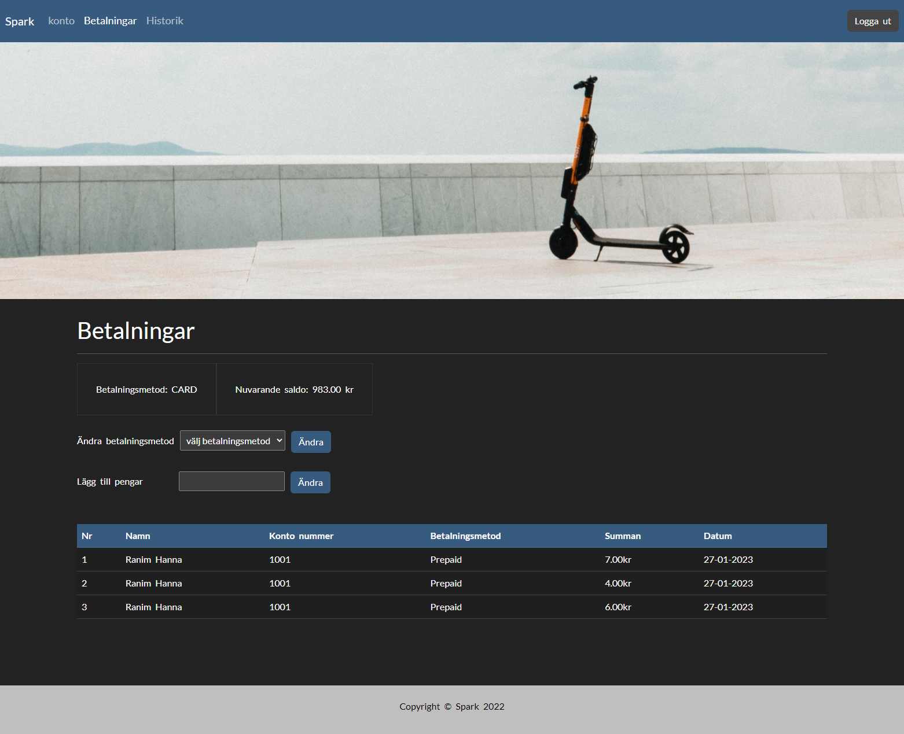

# Customer website

You can find all parts (all pages) here.

## Login page

Customer can log in using either email address and password or using google account.

## Register page

Customer can sign up here.

## Profile page

Contains all customer profile information for the logged in customer.

## History page

The customer can see a history of the trips.

## Payment page

The customer can add money to his account (prepaid), or let the system withdraw money every month via a payment service. The customer can also see an overview of his payments, account number, the amount he paid and the payment date.

