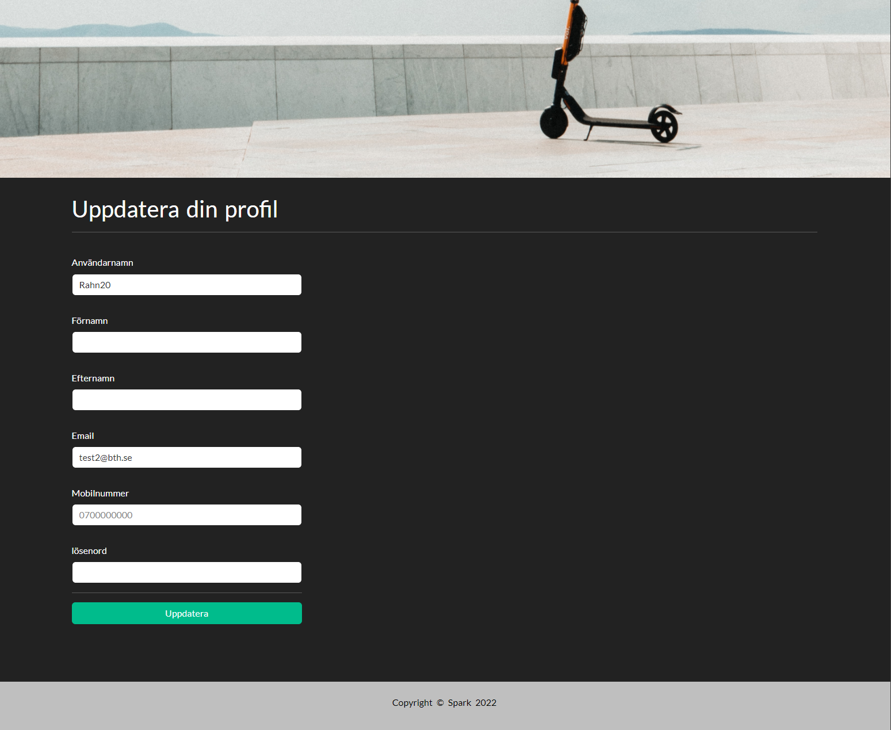

# Customer webpage

You can find all parts (all pages) here.

## Login page

Customer can log in using either email address and password or using google account.

## Register page

Customer can sign up here.

## Profile page

Contains all customer profile information for the logged in customer.

## Update profile page

The customer can update his profile information.

## History page

The customer can see an overview of all the trips he has made (the scooter he had rented, start and end date/time, start and end locations)

## Payment page

The customer can add money to his account and change the payment method. The customer can also see an overview of his payments, account number, the amount he paid, the payment method and payment date.

